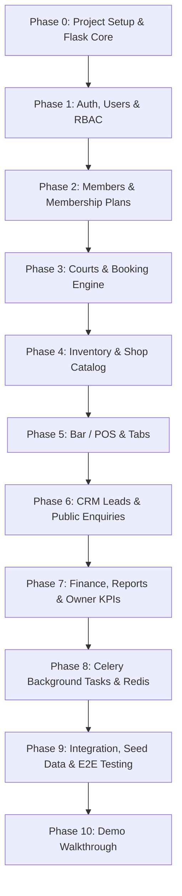

# Champions Club (Odoo_Finale) — Backend Reconnaissance Findings

**Author:** Developer A (Backend Lead)  
**Date:** October 3, 2026  
**Repository Branch:** `chore/repo-recon`  
**Status:** Completed (Read-Only Reconnaissance Pass)

---

## 1. Executive Summary & Repository Inspection

A complete reconnaissance of the `Odoo_Finale` repository was conducted. The project is at **Day 0 (greenfield state)**.

- **Current Repository Layout:**
  ```text
  d:\Project\Odoo\Odoo_Finale\
  ├── .git/
  ├── README.md
  └── docs/
      ├── architecture.md
      ├── design.md
      ├── design_v2.md
      ├── memory.md
      ├── phases.md
      ├── prd.md
      └── rules.md
  ```
- **Existing Backend Code:** None (`backend/` directory is not yet created).
- **Existing Frontend Code:** None (`frontend/` directory is not yet created).
- **Dependencies & Manifests:** No package managers or manifests exist (`requirements.txt`, `Pipfile`, `package.json` are absent). No virtual environment is present.
- **Database & Migration State:** No database files (`.db`, `.sqlite`) exist. No migration scripts or Alembic version histories exist.

---

## 2. Synthesis of Project Documentation (Backend-Relevant)

| Document | Core Backend Requirements & Takeaways |
| :--- | :--- |
| **`docs/prd.md`** | **Core problem:** Replace fragmented WhatsApp, Excel, paper receipts, and phone calls with one unified digital backbone.<br>• **P0 MVP:** Authentication, RBAC, Members, Memberships, Courts, Booking overlap prevention, Payments, Owner Dashboard.<br>• **P1:** Shop & Inventory, Bar/POS, Member discounts, CRM, Celery/Redis background jobs.<br>• **P2:** Online ordering/delivery, advanced reports, HR workflows. |
| **`docs/architecture.md`** | **Modular Monolith:** Single Flask REST backend and single Next.js frontend.<br>• **Layering:** Flask API routes → Marshmallow Schemas → Domain Services → SQLAlchemy Models → SQLite (dev) / PostgreSQL (prod).<br>• **Async Worker:** Redis message broker with Celery workers for emails, notification dispatch, and Excel/report exports.<br>• **Domain Modules:** `auth`, `members`, `memberships`, `courts`, `bookings`, `shop`, `inventory`, `pos`, `crm`, `payments`, `employees`, `reports`, `tasks`, `common`. |
| **`docs/rules.md`** | **Engineering & Safety Constraints:**<br>• Backend is the sole authority for security, pricing, booking validation, and inventory deduction.<br>• Standardized JSON response envelopes: `{"success": true, "data": {...}}` and `{"success": false, "error": {"code": "...", "message": "..."}}`.<br>• **Zero raw exception exposure:** No stack traces returned to clients; no silent `except Exception: pass`.<br>• **Auth & RBAC:** Roles (`OWNER`, `ADMIN`, `FRONT_DESK`, `SHOP_STAFF`, `BAR_STAFF`, `COACH`, `MEMBER`) enforced on endpoints.<br>• **Transactional integrity:** Immediate booking and payment transactions must remain synchronous; background Celery tasks handle side-effects (emails, notifications). |
| **`docs/phases.md`** | **11 Structured Execution Phases:**<br>• Phase 0: Project Setup (Flask, SQLite, Redis/Celery skeleton, Healthcheck)<br>• Phase 1: Auth & Users (JWT, Bcrypt, Roles, RBAC decorators)<br>• Phase 2: Members & Memberships (Tiers: Gold/Silver/Junior, Expiry)<br>• Phase 3: Courts & Bookings (Conflict prevention, 1h session / 30m slots, max 2/day)<br>• Phase 4: Shop & Inventory (Unified stock, movements, low-stock alerts)<br>• Phase 5: Bar / POS (Tables, tabs, kitchen status, payment methods)<br>• Phase 6: CRM & Website (Enquiries, trial booking, pipeline stages)<br>• Phase 7: Finance, Reports & Owner Dashboard (Aggregation, Excel export)<br>• Phase 8: Celery Background Jobs (Async queue handling)<br>• Phase 9: Integration & Demo Hardening (E2E workflows, seed data)<br>• Phase 10: Hackathon Demo. |
| **`docs/memory.md`** | **Project North Star & Demo Journey:**<br>• Golden demo flow: `New member → Gold membership → Court booking → Shop purchase → Bar order → Payment → Owner dashboard`.<br>• Build minimal, highly reliable modules; avoid premature library bloat. |
| **`docs/design.md`** | **API & Operational Contracts:**<br>• Fast front-desk member search (by query: ID, name, email, phone).<br>• Court calendar slot matrix: date-driven slot availability grid with statuses (`available`, `booked`, `social_play`, `blocked`).<br>• High-speed POS endpoint contract (table selection, tab management, discount application, multi-tender split payment).<br>• CRM pipeline stages: `NEW` → `CONTACTED` → `TRIAL_BOOKED` → `QUOTE_SENT` → `CONVERTED`.<br>• Owner dashboard aggregated KPIs (Daily/Monthly revenue, active members, utilization %, low stock items). |

---

## 3. Tech Stack & Target Architecture Mapping

### Locked Stack Specification
- **Language & Framework:** Python 3.11+, Flask 3.x
- **Database ORM & Migrations:** SQLAlchemy 2.x, Flask-SQLAlchemy, Alembic / Flask-Migrate
- **Serialization & Validation:** Marshmallow, Flask-Marshmallow, Marshmallow-SQLAlchemy
- **Authentication & Security:** Flask-JWT-Extended, Flask-Bcrypt (or `bcrypt`), Flask-CORS
- **Async & Caching:** Redis 7+, Celery 5+
- **Testing & Quality:** Pytest, pytest-flask, pytest-cov, flake8 / black
- **Reporting & Exports:** openpyxl / pandas
- **Production Server:** Gunicorn

### Target Structure Comparison

```text
Current Repo                        Target Structure                   Status
-----------------------------------------------------------------------------------
/                                  /
├── README.md                      ├── README.md                      [Exists]
├── docs/                          ├── docs/                          [Exists]
│   ├── prd.md                     │   ├── prd.md                     [Exists]
│   ├── architecture.md            │   ├── architecture.md            [Exists]
│   ├── rules.md                   │   ├── rules.md                   [Exists]
│   ├── phases.md                  │   ├── phases.md                  [Exists]
│   ├── memory.md                  │   ├── memory.md                  [Exists]
│   └── design.md                  │   └── design.md                  [Exists]
[Missing]                          ├── backend/                       [To Create]
                                   │   ├── app/
                                   │   │   ├── __init__.py
                                   │   │   ├── config.py
                                   │   │   ├── extensions.py
                                   │   │   ├── common/
                                   │   │   ├── auth/
                                   │   │   ├── members/
                                   │   │   ├── memberships/
                                   │   │   ├── courts/
                                   │   │   ├── bookings/
                                   │   │   ├── payments/
                                   │   │   ├── inventory/
                                   │   │   ├── shop/
                                   │   │   ├── pos/
                                   │   │   ├── crm/
                                   │   │   ├── employees/
                                   │   │   ├── reports/
                                   │   │   └── tasks/
                                   │   ├── migrations/
                                   │   ├── tests/
                                   │   ├── requirements.txt
                                   │   ├── .env.example
                                   │   └── run.py
[Missing]                          └── frontend/                      [To Create by Frontend Team]
```

---

## 4. Architectural Conflicts & Technical Risks

1. **Development vs Production Database Concurrency Handling:**
   - *Conflict:* In SQLite (dev), pessimistic row locking (`with_for_update()`) is either ignored or locks the entire table/database file. In PostgreSQL (prod), row-level locks prevent race conditions on court slot booking.
   - *Mitigation:* Implement explicit transactional conflict detection logic with unique composite constraint/check queries within the booking service transaction, backed by database constraints where appropriate.
2. **Shop vs Inventory Boundary:**
   - *Conflict:* Both `shop/` and `inventory/` directories exist in the architecture specification.
   - *Mitigation:* Clear separation of responsibilities: `inventory/` owns `Product`, `ProductCategory`, `StockItem`, and `StockMovement` (audit ledger); `shop/` owns `ShopOrder`, `OrderItem`, and cart/checkout workflows.
3. **Bar / POS vs Payment Service Decoupling:**
   - *Conflict:* POS transactions involve tabs, items, and multi-tender payments (Cash, Card, UPI).
   - *Mitigation:* `pos/` handles tables, kitchen status, and tabs; financial settlement records are delegated to `payments/` service producing immutable `PaymentTransaction` records.
4. **Celery Worker Execution on Local Development (Windows):**
   - *Conflict:* Celery's default prefork worker pool is unstable on Windows OS.
   - *Mitigation:* Configure Celery with `--pool=solo` or `threads` for local Windows development, with `CELERY_TASK_ALWAYS_EAGER = True` option in testing config.

---

## 5. Domain Ambiguities & Resolution Proposals

### 1. Booking Engine
- **Ambiguity 1 (Slot Intervals vs Session Duration):** Sessions are 1 hour (60 min), but slots open every 30 minutes (e.g., 06:00, 06:30, 07:00). A booking for 06:00–07:00 directly overlaps with a requested booking for 06:30–07:30.
  - *Resolution:* Overlap rule formula: `NewBooking.start_time < ExistingBooking.end_time AND NewBooking.end_time > ExistingBooking.start_time` on the same `court_id` for all non-cancelled bookings.
- **Ambiguity 2 (Daily Limit Scope):** Does the "maximum 2 bookings per member per day" rule include cancelled bookings?
  - *Resolution:* Only bookings with status `CONFIRMED` or `COMPLETED` on the given calendar date count towards the limit. `CANCELLED` bookings release the slot and count allowance.
- **Ambiguity 3 (Social Play Support):** Is Friday Social Play a block on regular bookings or a special multi-participant session?
  - *Resolution:* Dedicated `is_social_play` court slot type that allows multi-member registration without triggering individual 1-hour court exclusivity conflicts.

### 2. Memberships & Pricing
- **Ambiguity 1 (Tier Pricing Rules):** Gold vs Silver vs Junior vs Walk-in pricing matrix for court sessions and shop discounts.
  - *Resolution:* Store base hourly rates on the `Court` model; define discount multipliers on `MembershipPlan` (e.g., Gold: 100% court discount or fixed quota + 15% shop discount; Silver: 50% court discount + 10% shop discount; Junior: special coaching/court rate; Walk-in: 0% discount).
- **Ambiguity 2 (Plan Expiration & Grace Period):** What happens when a membership expires?
  - *Resolution:* `Membership` record transitions to `EXPIRED` status via daily Celery task or dynamic property check; booking falls back to standard Walk-in rates.

### 3. Payments & Bar/POS Tabs
- **Ambiguity 1 (Tabs Lifecycle):** Can a POS Tab remain open overnight?
  - *Resolution:* Bar tabs must belong to an active `Member` (or table guest). End-of-day reporting flags `OPEN` tabs as uncollected revenue.
- **Ambiguity 2 (Payment Split / Multi-Tender):** Can an invoice/tab be settled partially in Cash and UPI?
  - *Resolution:* Each `PaymentTransaction` records method (`CASH`, `CARD`, `UPI`, `ONLINE`), amount, reference ID, and links to an `Invoice` / `Order` / `Tab`.

### 4. Inventory & Stock Tracking
- **Ambiguity 1 (Stock Deduction Trigger):** When is stock reserved?
  - *Resolution:* Deducted atomically upon order placement/checkout completion to avoid inventory deadlocks. Negative stock is strictly disallowed at the service layer.

### 5. CRM Pipeline & Conversion
- **Ambiguity 1 (Lead to Member Transition):** How does CRM convert a lead into a member?
  - *Resolution:* `POST /api/v1/crm/leads/<id>/convert` automatically creates a `User`, `Member`, and pending `Membership` record, returning the member ID.

---

## 6. Comprehensive Implementation Plan



### Phase Breakdown

- **Phase 0 — Project Setup & Application Skeleton (Next Immediate Step)**
  - Scaffold `backend/` directory structure.
  - Set up `requirements.txt` with locked dependencies.
  - Implement application factory (`app/__init__.py`), configuration (`config.py`), extensions (`extensions.py`), and error handling (`common/errors.py`, `common/responses.py`).
  - Configure Flask-Migrate / Alembic and SQLite database initialization.
  - Implement health check endpoint `GET /api/v1/health`.
- **Phase 1 — Authentication, Users & Role-Based Authorization**
  - Implement `User` model, password hashing with Bcrypt, and JWT authentication (`/api/v1/auth/register`, `/api/v1/auth/login`, `/api/v1/auth/me`).
  - Implement permission decorators (`@roles_required`, `@jwt_required_custom`).
  - Unit tests for authentication and authorization.
- **Phase 2 — Members & Memberships Management**
  - Models: `Member`, `MembershipPlan` (Gold, Silver, Junior), `MembershipHistory`.
  - CRUD endpoints and fast front-desk member search.
- **Phase 3 — Courts & Robust Booking Engine**
  - Models: `Court`, `Booking`, `TimeSlot`.
  - Business logic: Overlap prevention, 30-min slot intervals, 1-hour session duration, max 2 active bookings/day limit, pricing rules.
- **Phase 4 — Inventory & Shop**
  - Models: `Product`, `Category`, `StockMovement`, `ShopOrder`, `OrderItem`.
  - Atomic stock deductions and low-stock alerts.
- **Phase 5 — Bar / POS & Tabs**
  - Models: `Table`, `BarOrder`, `BarOrderItem`, `Tab`.
  - Touch-friendly POS endpoints, table status, tab management, discount application.
- **Phase 6 — CRM & Enquiries**
  - Models: `Lead`, `TrialBooking`, `FollowUpNote`.
  - Lead capture, Kanban status transitions, conversion workflow.
- **Phase 7 — Finance, Payments & Owner Reporting Dashboard**
  - Models: `PaymentTransaction`, `Invoice`.
  - Revenue aggregation, court utilization metrics, Excel export generator (`openpyxl`).
- **Phase 8 — Celery Background Processing & Notifications**
  - Celery worker tasks for email dispatch, expiry notifications, low-stock warnings, and report generation.
- **Phase 9 — Integration, Seed Data & Demo Hardening**
  - Comprehensive seed script (`python seed.py`) populating realistic demo data (Courts, Plans, Members, Bookings, Orders, Tabs, KPIs).
  - Pytest test suite covering full golden path.
- **Phase 10 — Hackathon Demonstration Readiness**
  - Verify complete workflow: `New member → Gold membership → Court booking → Shop purchase → Bar order → Payment → Owner dashboard`.

---

## 7. Exact File Manifest for Phase 0 & Phase 1

### Phase 0: Project Setup (Files to Create)
1. `backend/requirements.txt` — Python dependencies (Flask, SQLAlchemy, Alembic, JWT, Marshmallow, Celery, Redis, Pytest, etc.).
2. `backend/.env.example` — Template environment variables (`FLASK_ENV`, `SECRET_KEY`, `JWT_SECRET_KEY`, `DATABASE_URL`, `REDIS_URL`).
3. `backend/.gitignore` — Python, venv, and SQLite ignore rules.
4. `backend/run.py` — WSGI entrypoint.
5. `backend/app/__init__.py` — Flask application factory (`create_app`).
6. `backend/app/config.py` — Config classes (`DevelopmentConfig`, `TestingConfig`, `ProductionConfig`).
7. `backend/app/extensions.py` — Initialization of `db`, `migrate`, `jwt`, `bcrypt`, `ma`, `cors`, `celery`.
8. `backend/app/common/__init__.py`
9. `backend/app/common/errors.py` — Custom error classes and global HTTP error handlers.
10. `backend/app/common/responses.py` — Standardized response helpers (`success_response`, `error_response`).
11. `backend/app/common/utils.py` — Date/time and math helper utilities.
12. `backend/app/health/__init__.py`
13. `backend/app/health/routes.py` — `GET /api/v1/health` endpoint.
14. `backend/tests/__init__.py`
15. `backend/tests/conftest.py` — Pytest fixtures (`app`, `client`, `db_session`).
16. `backend/tests/test_health.py` — Healthcheck endpoint tests.

### Phase 1: Authentication & Users (Files to Create)
1. `backend/app/common/permissions.py` — Role enums (`RoleEnum`), `@roles_required`, `@admin_required` decorators.
2. `backend/app/auth/__init__.py` — Auth blueprint definition.
3. `backend/app/auth/models.py` — `User` model with password hashing and role definitions.
4. `backend/app/auth/schemas.py` — Marshmallow schemas (`UserRegisterSchema`, `UserLoginSchema`, `UserResponseSchema`).
5. `backend/app/auth/services.py` — User creation, authentication, JWT token issuance.
6. `backend/app/auth/routes.py` — Routes for `/api/v1/auth/register`, `/api/v1/auth/login`, `/api/v1/auth/me`, `/api/v1/auth/refresh`.
7. `backend/tests/test_auth.py` — Unit & integration tests for authentication and role authorization.
8. `backend/migrations/` — Initial Alembic migration environment and version files.

---

## 8. Conclusion & Sign-Off

The repository is fully analyzed, and the backend architecture is aligned with the modular monolith specification. Phase 0 and Phase 1 file paths and dependencies are defined and ready for immediate implementation.
